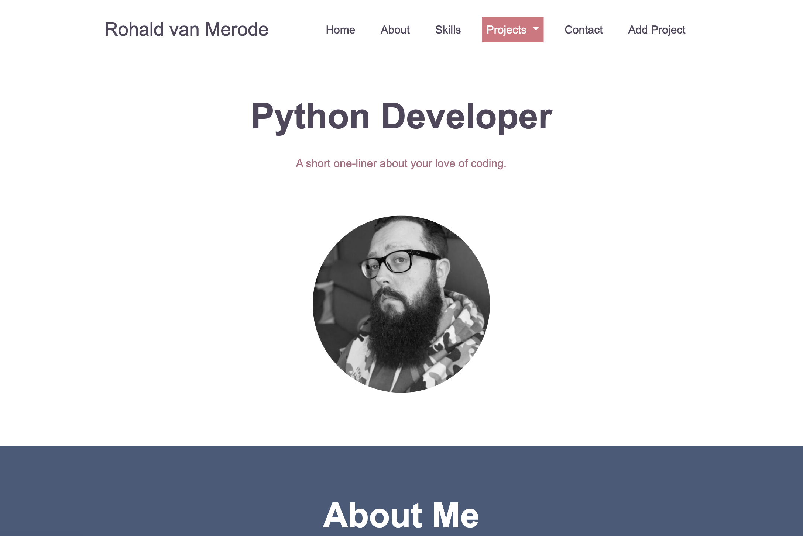

# Python Techdegree - Portfolio with SQLAlchemy

This is my solution to the final project of the Treehouse [Python TechDegree](https://teamtreehouse.com/techdegree/python-development). 

## Table of contents

- [Overview](#overview)
  - [The challenge](#the-challenge)
  - [How to run the project locally](#run-the-project)
  - [Screenshot](#screenshot)
  - [Links](#links)
- [My process](#my-process)
  - [Built with](#built-with)
  - [What I learned](#what-i-learned)
  - [Continued development](#continued-development)
- [Author](#author)

 

## Overview
---
 

### The challenge
 
Users should be able to:

- View a page of projects 
- View a details page with more information about a specific project
- Add new projects to the database
- Edit existing projects from the database
- Delete a project from the database

Other features: 

- Routing for the different pages
- Templates are using a layout.html file for the repeated code
- 404 error handling
- Clean code following PEP8 standards

 

### Run the project locally

- Download the project files
- Start up a virtual environment in the project folder
- Install the dependencies listed in the `requirements.txt` file
- run `app.py` file 
- the page will be available at `http://127.0.0.1:8000/`

 

### Screenshot

### Links

- Github URL: [SQLAlchemy-portfolio](https://github.com/rohald89/sqlalchemy-portfolio)
<!-- - Live Site URL: [Add live site URL here](https://your-live-site-url.com) -->

 

## My process
 

### Built with

- Python
- [Flask](https://flask.palletsprojects.com/en/2.0.x/quickstart/)
- [SQLAlchemy](https://www.sqlalchemy.org/)

 

### What I learned

This was the first project I created using Flask so I've learned quite a bit about things like creating routes and using templates using Flask. Having created backend projects using Node / Express before it wasn't completely new to me but it was great to see how Flask handles these things. 

 

### Continued development

I've really enjoyed working with Flask and coming from a JavaScript / Node background I certainly see myself using Flask more often in the future. I'd love to dive deeper into the possibilities with Flask and SQLAlchemy with things like authentication and relational databases. 

 

## Author

- Website - [Rohald van Merode](https://rohald.dev)
- Frontend Mentor - [@rohald89](https://www.frontendmentor.io/profile/rohald89)
- LinkedIn - [rohald89](https://www.linkedin.com/in/rohald89/)

